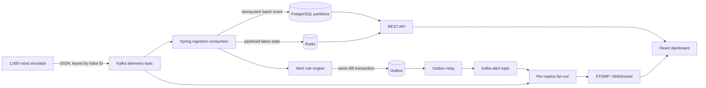

# Robotic Fleet Telemetry Platform

[](https://github.com/SreenadhSingamaneni/RoboFleet-Distributed-Telemetry-Fleet-Management-Platform/actions/workflows/ci.yml)
[](https://github.com/SreenadhSingamaneni/RoboFleet-Distributed-Telemetry-Fleet-Management-Platform/actions/workflows/security.yml)
[](https://openjdk.org/projects/jdk/21/)
[](LICENSE)

A production-oriented, event-driven platform that simulates **1,000 autonomous hospital robots**, ingests their telemetry through Kafka, stores durable history in PostgreSQL, maintains live state in Redis, evaluates operational alerts, and streams updates to a React command center over WebSockets.

This repository demonstrates production-oriented backend and distributed-systems design with explicit failure semantics, measurable behavior, clean architecture, and deployability.

## What the system demonstrates

- Java 21 and Spring Boot 3 backend with clean architecture boundaries
- Kafka batch consumption, partitioning by robot ID, retries, invalid-event routing, and dead-letter handling
- At-least-once delivery with idempotent PostgreSQL inserts
- Transactional outbox for reliable alert publication
- Spring Data JPA for control-plane aggregates and JDBC batching for the telemetry hot path
- PostgreSQL range partitioning, Flyway migrations, constraints, and query-aligned indexes
- Redis pipelining, TTL-based latest-state caching, and cache-failure degradation
- Extensible rule-based alert engine with lifecycle transitions and notification suppression
- Per-replica Kafka fan-out for horizontally correct WebSocket updates
- Python simulator with stateful movement, missions, charging, faults, Kafka backpressure, and metrics
- React + TypeScript dashboard using REST, STOMP/WebSockets, React Query, and lazy-loaded charts
- Docker Compose development environment with health checks and persistent volumes
- Prometheus metrics, alert rules, exporters, and a provisioned Grafana dashboard
- GitHub Actions for tests, container builds, security scans, and AWS deployment
- Terraform reference architecture for ECS Fargate, MSK, RDS PostgreSQL, ElastiCache, ALB, ECR, Secrets Manager, and autoscaling

## Architecture



The application is a **modular monolith**, not a collection of premature microservices. Domain rules, use cases, and infrastructure adapters are separated now; a service can be extracted later when independent scaling, ownership, or deployment frequency justifies the operational cost.

### End-to-end telemetry flow

1. The simulator keeps state for every robot and emits one versioned event per configured tick.
2. The robot ID is the Kafka key, so one robot's events remain ordered within one partition.
3. Spring Kafka polls records in batches. Bean Validation rejects malformed events to `fleet.telemetry.invalid.v1` without poisoning valid records in the same poll.
4. A JDBC batch inserts telemetry using `ON CONFLICT DO NOTHING`. A retry of the same event has the same `(event_id, recorded_at)` key and is harmless.
5. The same database transaction updates each robot's materialized snapshot only when the incoming timestamp is newer.
6. Accepted events are pipelined to Redis with a TTL. Redis failure does not roll back durable PostgreSQL ingestion.
7. Alert rules reconcile observed conditions with active alert aggregates. Opening, escalating, acknowledging, and resolving are explicit domain transitions.
8. Alert rows and outbox rows commit together. The relay later publishes the outbox payload to Kafka and marks it published.
9. Every backend replica has a unique fan-out consumer group, so every replica receives the complete telemetry and alert stream for its own connected WebSocket clients.
10. The dashboard combines periodic REST reconciliation with low-latency STOMP updates.

## Quick start

### Requirements

- Docker Engine 25+ with Docker Compose v2
- At least 8 GB of memory available to Docker
- Git

Java, Maven, Python, Node.js, PostgreSQL, Kafka, and Redis do **not** need to be installed when using Docker Compose.

### Run the complete platform

```bash
cp .env.example .env
docker compose up --build -d
docker compose ps
```

The first build downloads container images and dependencies, so it can take several minutes.

| Surface | URL | Local credentials |
| --- | --- | --- |
| Fleet dashboard | http://localhost:3000 | API key is embedded only for the local demo |
| Backend health | http://localhost:8080/actuator/health | None |
| Prometheus | http://localhost:9090 | None |
| Grafana | http://localhost:3001 | `admin` / `admin-local-only` |
| Simulator metrics | http://localhost:8000/metrics | None |

Follow startup and ingestion:

```bash
docker compose logs -f backend simulator
```

Check the API directly:

```bash
curl -H 'X-API-Key: local-demo-key-change-me' \
  http://localhost:8080/api/v1/fleet/summary

curl -H 'X-API-Key: local-demo-key-change-me' \
  'http://localhost:8080/api/v1/robots?status=ONLINE&size=10'

curl -H 'X-API-Key: local-demo-key-change-me' \
  'http://localhost:8080/api/v1/alerts?status=OPEN&size=20'
```

Stop without deleting data:

```bash
docker compose down
```

Reset the complete local environment:

```bash
docker compose down -v --remove-orphans
```

That last command permanently removes this project's local Docker volumes.

## Suggested five-minute demo

1. Open the dashboard and show that robot state changes without page refreshes.
2. Open Grafana and point to accepted events per second, ingestion latency, and Kafka consumer lag.
3. Increase load in `.env`, for example `SIMULATOR_RATE_HZ=2`, then recreate the simulator:

   ```bash
   docker compose up -d --force-recreate simulator
   ```

4. Stop the simulator and explain how the stale-robot scheduler transitions robots offline and opens connectivity alerts.
5. Restart it and show alerts resolving when fresh telemetry returns.
6. Replay or duplicate an event and explain why the composite primary key makes the write idempotent.
7. Show the outbox table and explain the database/Kafka dual-write failure it prevents.

## Repository structure

```text
robotic-fleet-telemetry-platform/
├── backend/                     Java 21 + Spring Boot service
│   ├── src/main/java/.../
│   │   ├── api/                 HTTP controllers and stable response DTOs
│   │   ├── application/         Use cases and outbound ports
│   │   ├── domain/              Framework-light models and alert rules
│   │   ├── infrastructure/      Kafka, Redis, JDBC, JPA, WebSocket adapters
│   │   └── config/              Typed configuration and framework wiring
│   ├── src/main/resources/
│   │   └── db/migration/        Versioned Flyway migrations
│   └── src/test/                Domain, service, and Testcontainers tests
├── simulator/                   Stateful Python robot load generator
├── dashboard/                   React + TypeScript operations UI
├── observability/               Prometheus rules and Grafana provisioning
├── infra/aws/terraform/         AWS reference deployment
├── docs/                        Design, implementation, and operations guides
├── .github/workflows/           CI, security, and deployment pipelines
└── docker-compose.yml           Complete local runtime
```

## Backend design

### Clean architecture boundaries

The dependency direction is inward:

```text
API / Kafka / Redis / PostgreSQL  ->  application ports and services  ->  domain model
```

The domain does not import JPA, Kafka, Redis, HTTP, or WebSocket types. Application services depend on interfaces such as `TelemetryStorePort` and `AlertRepositoryPort`; infrastructure adapters implement them. This keeps business rules unit-testable and prevents a database or transport choice from becoming the design.

### Why both JPA and JDBC?

JPA is used for `Robot` and `Alert` control-plane data where aggregate lifecycle, optimistic locking, specifications, and repository semantics improve correctness and readability.

Telemetry is an append-heavy hot path. Creating and tracking a Hibernate entity for every point adds allocation, dirty checking, and flush overhead without providing useful aggregate behavior. `TelemetryJdbcStore` therefore uses prepared JDBC batches while still sharing Spring's transaction management and connection pool.

### Delivery and consistency guarantees

| Boundary | Guarantee | Mechanism |
| --- | --- | --- |
| Simulator → Kafka | Idempotent producer, ordered per robot partition | `enable.idempotence=true`, `acks=all`, robot ID key |
| Kafka → PostgreSQL | At least once, idempotent effect | Manual acknowledgment after service success; composite primary key + `ON CONFLICT` |
| Snapshot updates | Newer observation wins | Timestamp predicate in the robot update |
| PostgreSQL → Redis | Best effort | Durable write first; cache exceptions are measured and suppressed |
| PostgreSQL alert → Kafka | At least once without loss on dual write | Transactional outbox + `FOR UPDATE SKIP LOCKED` relay |
| Kafka → WebSocket | Complete stream per backend replica | Unique fan-out consumer group per container |
| Dashboard state | Eventually reconciled | Live events plus periodic REST refetch |

“Exactly once” is intentionally not claimed end to end. The system makes side effects idempotent and uses at-least-once delivery, which is the more defensible production model across Kafka and PostgreSQL.

### Alert rules

Rules implement one interface:

```java
public interface TelemetryAlertRule {
    AlertType type();
    Optional<AlertCandidate> evaluate(TelemetryPoint telemetry);
}
```

Included rules:

- low battery with warning-to-critical escalation
- high controller temperature
- navigation stalled during an active mission
- degraded/disconnected connectivity
- reported robot error codes
- a scheduled stale-signal monitor for robots that stop publishing entirely

The engine loads active alerts once per batch, reconciles all rules, suppresses identical retriggers for 30 seconds, persists only changes, and writes matching outbox events in the same transaction.

## PostgreSQL model

| Table | Purpose |
| --- | --- |
| `robots` | Current materialized fleet registry and status |
| `telemetry` | Append-only durable history, partitioned monthly by `recorded_at` |
| `alerts` | Stateful alert lifecycle with optimistic versioning |
| `outbox_events` | Reliable post-commit integration events |

Important indexes match actual access patterns:

- `(robot_id, recorded_at DESC)` for robot history
- `(recorded_at DESC)` for time-window operations
- `(robot_id, sequence_number DESC)` for sequence diagnosis
- partial unique alert index on `(robot_id, type)` for active alerts
- partial outbox index containing unpublished events only

The `telemetry_default` partition prevents an unplanned timestamp from taking ingestion down. The specific monthly partitions keep pruning and retention operations bounded. In a long-running production environment, create future partitions automatically and detach/archive expired partitions instead of running large row-by-row deletes.

See [Data model](docs/data-model.md) for the ER diagram and retention strategy.

## REST API

All `/api/**` endpoints require `X-API-Key` in the local profile. Page sizes and telemetry limits are bounded server-side.

| Method | Endpoint | Purpose |
| --- | --- | --- |
| `GET` | `/api/v1/fleet/summary` | Fleet and alert KPIs |
| `GET` | `/api/v1/robots` | Search/filter paginated robots |
| `GET` | `/api/v1/robots/{id}` | Robot detail |
| `GET` | `/api/v1/robots/{id}/telemetry/latest` | Redis-backed latest point |
| `GET` | `/api/v1/robots/{id}/telemetry` | Bounded PostgreSQL history window |
| `GET` | `/api/v1/alerts` | Filtered/paginated alerts |
| `POST` | `/api/v1/alerts/{id}/acknowledge` | Acknowledge an active alert |

Errors use RFC 9457-style `ProblemDetail` responses rather than ad hoc strings.

## Kafka contracts

| Topic | Key | Value | Partitions locally |
| --- | --- | --- | --- |
| `fleet.telemetry.v1` | robot ID | `TelemetryEvent` JSON | 12 |
| `fleet.telemetry.invalid.v1` | robot ID | rejected event + reason | 3 |
| `fleet.telemetry.v1.dlt` | original key | infrastructure-failed record | 12 |
| `fleet.alerts.v1` | robot ID | `AlertEvent` JSON | 6 |

`schemaVersion` is included in every telemetry event. JSON keeps the repository self-contained; a multi-team production evolution would commonly add a schema registry with Avro or Protobuf compatibility checks.

## Capacity reasoning

The default workload is:

```text
1,000 robots × 1 event/second = 1,000 events/second
                              = 86.4 million events/day
```

At roughly 0.5–1.0 KB per serialized event before replication and indexes, indefinite PostgreSQL retention becomes expensive. A realistic policy is:

- Redis: latest point only, five-minute TTL
- PostgreSQL: 7–30 days of detailed operational history
- S3: compacted Parquet history for long-term analytics and model training
- aggregation tables: minute/hour rollups for long-range charts

Kafka has 12 telemetry partitions locally. Partition count sets the upper bound for consumer parallelism in one consumer group; adding application replicas without available partitions does not increase ingestion throughput.

## Resilience behavior

- **Malformed event:** published to the invalid topic; valid records in the batch continue.
- **Database unavailable:** Kafka offsets remain unacknowledged; Spring retries with exponential backoff, then recovers to a DLT after configured attempts.
- **Redis unavailable:** durable ingestion continues; cache failures increment `fleet.cache.failures`.
- **Backend crashes after DB commit but before Kafka acknowledgment:** Kafka redelivers; the insert conflicts and becomes a no-op.
- **Backend crashes after alert commit but before alert publish:** the unpublished outbox row is relayed after restart.
- **Outbox relay publishes but fails before marking the row:** the alert can be published again; consumers use stable alert IDs and tolerate duplicates.
- **One backend replica disappears:** Kafka rebalances durable ingestion, the ALB drains connections, and WebSocket clients reconnect.
- **Simulator producer queue fills:** it polls delivery callbacks and applies backpressure instead of dropping immediately.

## Observability

Spring Actuator and Micrometer expose:

- accepted, duplicate, and rejected telemetry totals
- ingestion latency histogram
- cache failures
- outbox publications and failures
- JVM, HTTP server, HikariCP, Kafka consumer, and process metrics

Prometheus also scrapes the simulator and PostgreSQL, Redis, and Kafka exporters. Grafana is provisioned with throughput, p50/p95/p99 latency, lag, rejection, and database panels. Alert rules cover backend unavailability, stopped telemetry, rejection spikes, high Kafka lag, and simulator delivery failures.

Useful production log fields include application name, trace ID, and span ID. For AWS, send ECS logs to CloudWatch and route metrics to Amazon Managed Service for Prometheus or an existing platform observability stack.

## Testing

Run everything installed locally:

```bash
make test
```

Or run components independently:

```bash
cd backend && ./mvnw verify
cd dashboard && npm ci && npm test && npm run build
cd simulator && python -m pip install -e '.[dev]' && ruff check . && pytest
```

Backend tests include domain state transitions, alert thresholds, application orchestration, and a PostgreSQL Testcontainers integration test that executes the real Flyway migrations and verifies duplicate suppression.

## Security posture

The local API key proves request filtering and constant-time secret comparison, but it is **not production user authentication**—a browser-delivered key is visible to the browser user. For production:

- terminate TLS at the ALB
- use Cognito or enterprise OIDC and short-lived tokens
- authorize operator/admin roles at the API and message-channel boundaries
- store service secrets in Secrets Manager and rotate them
- keep ECS, RDS, ElastiCache, and MSK in private subnets
- enable encryption at rest and in transit
- use MSK IAM/SASL or mutual TLS rather than unauthenticated Kafka clients
- restrict Actuator metrics to the monitoring network
- never place patient information in telemetry or logs

See [SECURITY.md](SECURITY.md).

## AWS reference architecture

The Terraform configuration provisions:

- a three-AZ VPC with public ALB subnets and private application/data subnets
- ECS Fargate services for backend and dashboard, plus an optional simulator
- Application Load Balancer with HTTPS and WebSocket routing
- Amazon MSK with three brokers and TLS
- Multi-AZ RDS PostgreSQL with encryption, backups, and deletion protection
- ElastiCache Redis replication group with Multi-AZ failover and TLS
- ECR repositories with immutable tags and scanning
- Secrets Manager credentials
- CloudWatch log groups
- ECS target-tracking autoscaling

Read [AWS deployment guide](infra/aws/README.md) before applying. The reference architecture creates billable resources; MSK, NAT Gateway, Multi-AZ RDS, and ElastiCache are not free-tier components.

## CI/CD

- `ci.yml`: Java tests, Python lint/tests, React test/build, Compose validation, and image builds
- `security.yml`: CodeQL and Trivy filesystem scanning
- `deploy-aws.yml`: GitHub OIDC authentication, immutable commit-SHA images, ECR push, and Terraform rollout
- Dependabot: Maven, npm, pip, Terraform, and Actions updates

The deployment workflow assumes the state backend, AWS OIDC role, base Terraform infrastructure, certificate, and bootstrap images have been prepared as described in the AWS guide.

## Architecture rationale

Hospital robots continuously generate operational telemetry. The platform must preserve durable history while providing operators with a low-latency view of current fleet state.

Kafka decouples telemetry producers from backend availability and preserves ordering within each robot partition. PostgreSQL stores auditable history, Redis maintains disposable current state, and WebSockets deliver live updates to connected operators.

The ingestion path uses at-least-once delivery with idempotent database writes. Alert publication uses a transactional outbox to close the consistency gap between PostgreSQL transactions and Kafka publication.

The backend is implemented as a modular monolith because the current modules share one ownership and deployment boundary. Domain, application, and infrastructure ports provide extraction points if ingestion, queries, alert processing, or WebSocket delivery later require independent scaling or deployment.

Key design considerations include:

- Robot ID is the Kafka key, preserving per-robot ordering.
- Kafka partition count limits useful consumer parallelism.
- JPA manages control-plane aggregates such as robots and alerts.
- JDBC batching handles the append-heavy telemetry path.
- Duplicate delivery is safe because durable writes are idempotent.
- The transactional outbox prevents committed alerts from being lost before Kafka publication.
- Each backend replica uses a distinct fan-out group for its local WebSocket clients.
- Redis failure degrades current-state reads without stopping durable ingestion.
- PostgreSQL partitions support pruning, bounded retention, and archival.
- Long-term raw telemetry can move to S3 and Parquet as storage volume grows.
- Modules can be extracted into separate services when scaling or ownership boundaries justify the added operational complexity.

See [System design walkthrough](docs/system-design-walkthrough.md) for detailed trade-offs, scaling considerations, and failure scenarios.


## Documentation

- [Architecture and failure semantics](docs/architecture.md)
- [Implementation and annotation guide](docs/implementation-guide.md)
- [Data model and retention](docs/data-model.md)
- [Operations runbook](docs/runbook.md)
- [Load-testing guide](docs/load-testing.md)
- [System design walkthrough](docs/system-design-walkthrough.md)
- [Architecture decision records](docs/adr/)

## Known production extensions

The repository is deliberately honest about what remains environment-specific:

- OIDC/Cognito authentication and role authorization
- Schema Registry with compatibility enforcement
- automated future partition creation and S3 archival
- OpenTelemetry collector/exporter wiring
- Kubernetes manifests if an organization standardizes on EKS
- multi-region disaster recovery and tested recovery-time objectives
- real device identity, certificate rotation, command-and-control authorization, and OTA updates

Those are roadmap items, not hidden claims. The included system is complete and runnable for its stated 1,000-robot workload.

## License

MIT. See [LICENSE](LICENSE).
