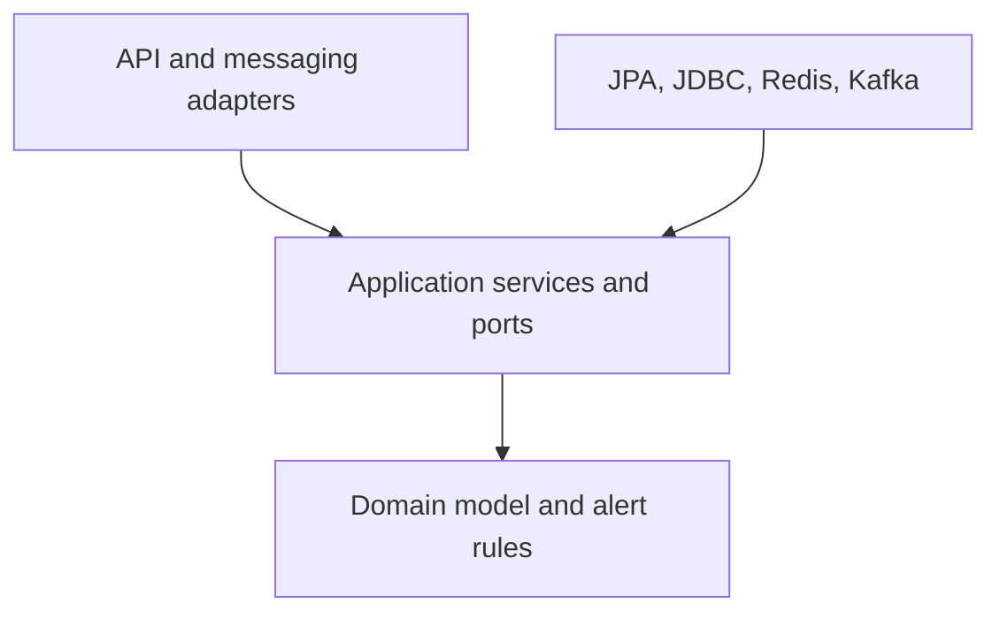
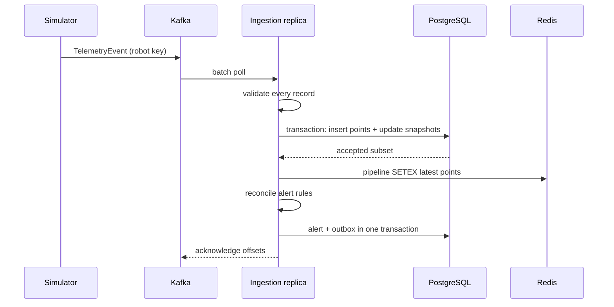
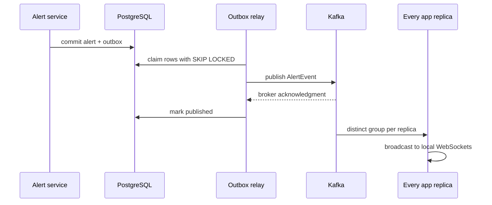
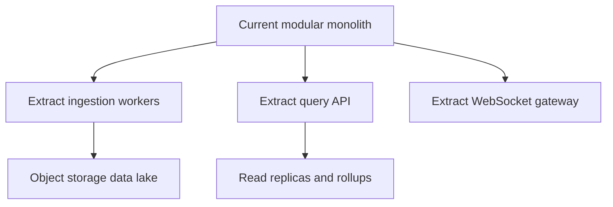

# Architecture and failure semantics

## System boundaries

The platform has four runtime applications and four infrastructure dependencies:

| Component | Responsibility | Owns durable data? |
| --- | --- | --- |
| Python simulator | Produces realistic robot state transitions and telemetry load | No |
| Spring backend | Ingestion, robot snapshots, alert lifecycle, queries, live fan-out | Through PostgreSQL |
| React dashboard | Operator views and alert acknowledgment | No |
| Observability stack | Metrics collection, visualization, and operational alerts | Prometheus time series only |
| Kafka | Durable ordered event log and workload buffering | Yes, for configured retention |
| PostgreSQL | Telemetry history, robot registry, alerts, outbox | Yes |
| Redis | Latest telemetry acceleration | No; rebuildable cache |
| ALB/Nginx | HTTP and WebSocket routing | No |

## Dependency rule

The domain layer contains no Spring, persistence, or transport annotations. `@Component` is currently used on stateless rule implementations for convenient discovery; extracting that wiring into configuration would make the domain entirely framework-free if needed.

## Telemetry sequence

## Alert outbox sequence

The outbox relay is at least once. A crash after Kafka accepts the message but before `published_at` commits can cause a duplicate. The alert ID is stable, so clients treat the event as an updated alert rather than a second alert.

## Horizontal scaling

Durable ingestion instances share one group: `fleet-telemetry-ingestor`. Kafka assigns each of the 12 partitions to exactly one consumer in that group. Ordering is maintained per robot because the producer uses robot ID as the key.

WebSocket fan-out is different. A client connected to replica A must see events durably processed by replica B. Therefore every replica uses a unique fan-out group based on its container hostname. Each replica receives the entire stream and broadcasts only to its own connections.

The simple Spring broker is sufficient locally because there is one backend. At a larger connection count, enable STOMP broker relay or extract a dedicated WebSocket gateway. The per-replica Kafka fan-out remains useful either way.

## Consistency model

- Telemetry history and robot snapshots are strongly consistent inside one PostgreSQL transaction.
- Latest telemetry in Redis is eventually consistent and disposable.
- Alerts are derived state. They are transactionally consistent with their own outbox events, but an alert evaluation happens after the telemetry transaction.
- REST history can show a point before Redis or the WebSocket stream shows it.
- Dashboard state is eventually reconciled through polling even if a WebSocket message is missed during reconnection.

## Failure matrix

| Failure | Immediate behavior | Recovery |
| --- | --- | --- |
| Invalid event | Route to invalid topic | Producer team inspects reason and replays corrected event |
| Kafka unavailable to simulator | Local producer queue fills and applies backpressure | Idempotent producer resumes; timed-out deliveries are counted |
| PostgreSQL unavailable | Listener invocation fails; offsets are not acknowledged | Retry/backoff, then DLT according to policy |
| Redis unavailable | Cache operation logs and increments failure metric | Durable path remains healthy; latest endpoint may return no content |
| Alert Kafka publish unavailable | Outbox transaction rolls back and row remains unpublished | Next relay attempt claims it |
| One backend killed | ALB connection closes; Kafka rebalances ingestion | STOMP client reconnects automatically |
| Schedulers run on many replicas | PostgreSQL advisory lock elects one transaction | Lock releases automatically on commit/rollback/connection loss |
| Old telemetry arrives | History accepts it; snapshot timestamp guard prevents regression | No manual recovery |
| Duplicate telemetry arrives | Composite primary-key conflict returns zero affected rows | No downstream cache/alert fan-out for the duplicate |

## Scaling evolution

Extraction is justified only when metrics show independent constraints:

- ingestion needs different CPU/memory scaling than REST
- query traffic interferes with consumer latency
- WebSocket connection count drives long-lived instance capacity
- alert rules require separate ownership or release cadence
- retention exceeds cost-effective relational storage
