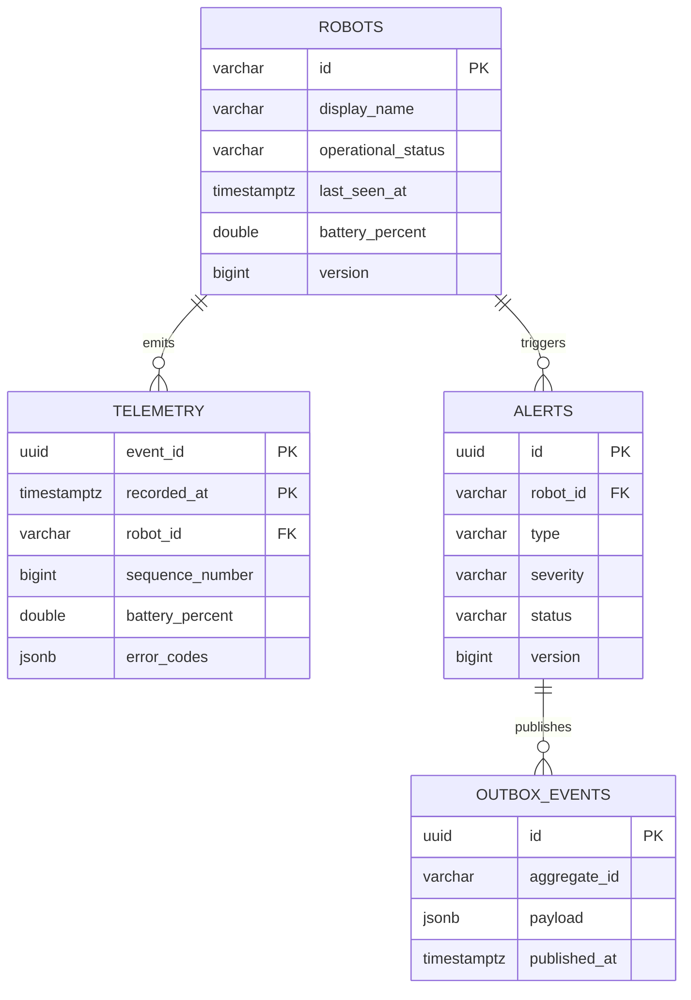

# Data model and retention

## Entity relationship diagram

`outbox_events.aggregate_id` is intentionally not a foreign key. Integration-event retention can outlive or cross aggregate types, and the relay should not be coupled to one domain table.

## Telemetry partitioning

PostgreSQL requires every unique constraint on a partitioned table to include the partition key. The primary key is therefore `(event_id, recorded_at)`. A Kafka redelivery contains an identical payload, so both values match and `ON CONFLICT DO NOTHING` suppresses it.

Migrations create the previous month plus 13 forward monthly partitions and a default partition. Production automation should:

1. create the next three partitions on a schedule;
2. verify the default partition remains empty or investigate rows in it;
3. detach partitions after the online retention window;
4. export detached data to compressed Parquet in S3;
5. drop the detached table only after export validation.

Partitioning improves pruning and retention operations. It does not make an unindexed query fast by itself.

## Index rationale

| Index | Query served |
| --- | --- |
| `telemetry(robot_id, recorded_at DESC)` | recent history for one robot |
| `telemetry(recorded_at DESC)` | fleet-wide time windows and retention diagnosis |
| `telemetry(robot_id, sequence_number DESC)` | ordering/gap investigation |
| `robots(operational_status)` | dashboard filter and status counts |
| `robots(last_seen_at)` | stale connectivity scan |
| active alert partial unique index | enforce one active alert per robot/rule |
| alert status/severity/time | operator alert queue |
| unpublished outbox partial index | relay claim query |

## Concurrency

`alerts.version` uses JPA `@Version`. Two operators or workers modifying one alert concurrently cannot silently overwrite each other; one transaction receives an optimistic-lock failure and should retry or return a conflict at a higher scale.

Robot snapshots are updated through JDBC rather than JPA. Their update includes `last_seen_at <= incoming.recorded_at`, which prevents late events from regressing current state.

## Data classification

This model contains device-operational data only. Do not add patient names, medical record numbers, room occupants, or clinical payloads. If a mission must reference a hospital workflow, use a non-identifying opaque mission ID and keep sensitive mapping in the authorized clinical system.

